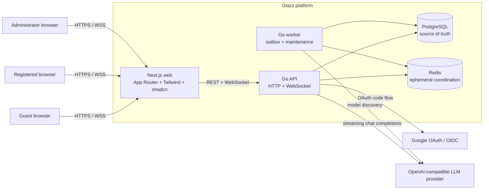

# Glazz

Glazz is a production-oriented, bilingual AI chat application built as a
portfolio-grade reference for API-first design, realtime systems, secure browser
authentication, provider portability, and incremental delivery.

The product offers a deliberately short guest trial and moves the durable
experience behind Google sign-in. Registered users receive persistent conversation
history, model selection, usage visibility, session management, and account
controls. Administrators manage model exposure, runtime limits, users, aggregate
usage, and an auditable configuration trail.

> **Release status:** M4 is published as `v0.4.0`. M5/Phase 9 is in progress and is
> hardening the release candidate through visual, security, load, failure, privacy,
> performance, and final contract reviews. Glazz is not yet approved for public
> production traffic.

## Why Glazz exists

Glazz is not a thin UI around a model API. It is designed around the concerns that
appear when an AI prototype becomes a multi-user service:

- bounded guest acquisition without requiring an account up front;
- durable identity, sessions, ownership, quotas, and deletion;
- ordered realtime streaming with reconnect and idempotency behavior;
- an internal model catalog independent from any one provider;
- server-side provider credentials and normalized provider failures;
- operational visibility without logging prompts or responses;
- contract-driven development across a TypeScript frontend and Go backend;
- explicit release gates before production infrastructure and public launch.

OpenCode Go is supported only as a development-time OpenAI-compatible endpoint. It
is not the selected production provider. The production provider remains an
explicit approval gate so commercial terms, retention, capacity, privacy, model
quality, and cost can be evaluated before launch.

## Product capabilities

### Guest

- Start chatting without creating an account.
- Use one short-lived conversation with a default limit of four prompts and 2,000
  output tokens.
- See the remaining allowance and a clear login gate at exhaustion.
- Resume the same guest session from a signed, HttpOnly browser cookie.
- Migrate the guest conversation exactly once after Google sign-in.

Guest limits do not reset automatically. Unmigrated guest data expires and is
removed by the worker.

### Registered user

- Sign in with Google OAuth 2.0/OpenID Connect and PKCE.
- Create, search, rename, archive, restore, and delete conversations.
- Stream responses, cancel an active generation, and retry the latest eligible
  failed or cancelled generation.
- Select an enabled model exposed to the registered audience.
- View daily message and output-token allowance.
- Switch between English and Spanish and light, dark, or system theme.
- Inspect and revoke active sessions.
- Reauthenticate before sensitive actions.
- Request account deletion with immediate session revocation and a 24-hour purge
  target.

The initial registered allowance is 50 messages, 50,000 output tokens per day, and
one concurrent generation. Administrators can change runtime limits.

### Administrator

- Synchronize the provider model catalog.
- Enable supported models, assign audience visibility, and choose guest/user
  defaults.
- Change typed runtime settings with optimistic concurrency.
- Inspect users and change roles subject to recent-auth and last-admin protection.
- Review aggregate usage, latency, and normalized error information.
- Browse a redacted, paginated audit trail.
- Enable maintenance mode without redeploying.

See [Product Capabilities](./docs/product-capabilities.md) for the implementation
matrix, journeys, constraints, and non-goals.

## Architecture at a glance



PostgreSQL is authoritative for identity, ownership, conversations, generation
state, quotas, usage, settings, audit, deletion jobs, and outbox events. Redis is
used only for TTL-bound or coordination state such as rate limits, WebSocket
tickets, replay buffers, cancellation, and cross-instance signaling. Correctness
must survive Redis eviction or restart by failing closed or rebuilding from
PostgreSQL.

For context, container, component, sequence, deployment, and scaling diagrams, see
[Technical Architecture](./docs/technical-architecture.md). The relational schema
is documented in [Data Model and ERD](./docs/data-model.md).

## Technology stack

| Area                | Technology                                   | Pinned version / role               |
| ------------------- | -------------------------------------------- | ----------------------------------- |
| Web runtime         | Node.js                                      | 24.13.0                             |
| Package manager     | pnpm workspaces                              | 11.17.0                             |
| Web framework       | Next.js App Router                           | 16.2.11                             |
| UI runtime          | React                                        | 19.2.8                              |
| Language            | TypeScript                                   | 5.9.3                               |
| Styling             | Tailwind CSS                                 | 4.3.3                               |
| Components          | shadcn CLI, Base UI, Lucide                  | 4.14.1, 1.6.0, 1.25.0               |
| Backend language    | Go                                           | toolchain 1.26.5                    |
| HTTP                | `net/http` + chi                             | chi 5.3.1                           |
| Realtime            | coder/websocket                              | 1.8.15                              |
| Durable store       | PostgreSQL                                   | 18.4 local image                    |
| Ephemeral store     | Redis                                        | 8.8.0 local image                   |
| SQL                 | pgx, sqlc, goose                             | 5.10.0, 1.31.1, 3.27.3              |
| Authentication      | Google OIDC/OAuth + JWT                      | go-oidc, oauth2, golang-jwt         |
| Contracts           | OpenAPI 3.1 + AsyncAPI 3.0                   | generated Go/TypeScript boundaries  |
| Telemetry           | OpenTelemetry + Prometheus                   | traces, metrics, structured logs    |
| Testing             | Go test/race/goleak, Vitest, Playwright, axe | unit through browser acceptance     |
| Local orchestration | Docker Compose                               | web, API, worker, PostgreSQL, Redis |

Dependency selection follows [Dependency and Documentation
Policy](./docs/dependency-policy.md). Context7 is the first documentation source,
followed by official upstream release and support information. Exact versions live
in manifests, lockfiles, `.tool-versions`, and container definitions.

## Repository layout

```text
.
├── apps/
│   ├── api/                  Go API, worker, migrations, SQL, and tests
│   └── web/                  Next.js application and browser tests
├── packages/
│   └── contracts/            OpenAPI, AsyncAPI, fixtures, generated TS types
├── deploy/                   Dockerfiles and local Compose topology
├── docs/
│   ├── adr/                  Architecture decision records
│   ├── runbooks/             Repeatable operational procedures
│   └── threat-model/         Threat analysis
├── scripts/                  Contract validation and repository tooling
├── PROJECT.md                Product scope and business rules
├── ARCHITECTURE.md           Canonical detailed architecture specification
├── DESIGN.md                 Product and interaction design system
├── TASKS.md                  Canonical phase/milestone tracker
├── WORKLOG.md                Append-only execution evidence
└── AGENTS.md                 Contributor and coding-agent rules
```

## Run the complete stack

### Prerequisites

The recommended path uses:

- Docker with the Compose plugin;
- Git;
- approximately 4 GB of free memory for the application and build containers;
- Google OAuth credentials only when testing real Google sign-in;
- an OpenAI-compatible endpoint only when testing a live LLM.

Node, pnpm, Go, PostgreSQL, and Redis do not need to be installed on the host for
the Compose path. Contributors running checks outside containers should install
the exact versions in `.tool-versions`; the project uses
[mise](https://mise.jdx.dev/) on the shared development server.

### 1. Configure the environment

Create the untracked root environment file from the complete template:

```bash
cp .env.example .env
```

Generate a local cookie-signing secret and set it as `COOKIE_SIGNING_KEY`:

```bash
openssl rand -base64 32 | tr '+/' '-_' | tr -d '='
```

Every key declared by `.env.example` must exist in `.env`, including keys whose
valid development value is empty. Do not commit `.env`. Variables injected by the
shell, CI, or an orchestrator take precedence over the file.

The safest first run uses the deterministic fake provider:

```dotenv
LLM_PROVIDER_KIND=fake
LLM_PROVIDER_BASE_URL=
LLM_PROVIDER_API_KEY=
LLM_DEFAULT_MODEL=deepseek-v4-flash
```

This provider is deterministic and does not call an external model. It exists for
development and automated tests.

### 2. Start services

From the repository root:

```bash
docker compose -f deploy/compose.yaml up --build
```

Compose starts:

| Service    | Local address                  | Purpose                                          |
| ---------- | ------------------------------ | ------------------------------------------------ |
| Web        | `http://localhost:3000`        | Next.js user interface                           |
| API        | `http://localhost:8080/api/v1` | HTTP and WebSocket API                           |
| PostgreSQL | `localhost:5432`               | durable application state                        |
| Redis      | `localhost:6379`               | ephemeral coordination                           |
| Worker     | internal                       | outbox, model sync, guest cleanup, account purge |

The API container runs forward migrations before accepting traffic. This is a
local-development convenience; production runs migrations as one explicit
pre-deploy job.

### 3. Verify the stack

```bash
docker compose -f deploy/compose.yaml ps
curl --fail http://localhost:8080/api/v1/health/live
curl --fail http://localhost:8080/api/v1/health/ready
curl --fail http://localhost:8080/api/v1/config/public
```

Open `http://localhost:3000`. The chat composer becomes available after the
connection indicator reports that realtime communication is connected.

### 4. Stop services

```bash
docker compose -f deploy/compose.yaml down
```

PostgreSQL data remains in the `postgres-data` volume. Use
`docker compose -f deploy/compose.yaml down --volumes` only for an intentional
local data reset.

## Use a live OpenAI-compatible provider

Glazz owns a provider-neutral gateway and currently implements the
OpenAI-compatible Chat Completions surface. Configure server-only values:

```dotenv
LLM_PROVIDER_KIND=openai_compatible
LLM_PROVIDER_BASE_URL=https://provider.example/v1
LLM_PROVIDER_API_KEY=replace-with-a-development-key
LLM_DEFAULT_MODEL=provider-model-id
```

Restart the API and worker after changing provider configuration:

```bash
docker compose -f deploy/compose.yaml up --build --force-recreate api worker
```

The worker discovers provider models. Discovery does not expose every returned
model automatically: models must be supported and explicitly enabled for a guest
or registered audience. This separation prevents provider catalog changes from
silently altering the product.

Provider credentials are read only by Go processes. Never prefix them with
`NEXT_PUBLIC_`, return them from `/config/public`, or place them in browser code.

OpenCode Go may be configured here for local development, but it is not a production
dependency or an approved multi-user service provider.

## Configure Google login

Create an OAuth 2.0 Web application in Google Cloud and configure:

- authorized JavaScript origin: `http://localhost:3000`;
- authorized redirect URI:
  `http://localhost:8080/api/v1/auth/google/callback`.

Then set:

```dotenv
GOOGLE_CLIENT_ID=your-client-id
GOOGLE_CLIENT_SECRET=your-client-secret
GOOGLE_CALLBACK_URL=http://localhost:8080/api/v1/auth/google/callback
OAUTH_TEST_MODE=false
```

OAuth state is single-use and TTL-bound. The code flow uses PKCE, the callback
validates OIDC claims, and arbitrary post-login return URLs are rejected.

`OAUTH_TEST_MODE=true` enables a deterministic local authorization screen for E2E
tests. Configuration loading forbids this mode in production.

## Run without Docker

Use this mode when iterating on one application while PostgreSQL and Redis are
already available.

### Install dependencies

```bash
pnpm install --frozen-lockfile
```

### Start infrastructure

```bash
docker compose -f deploy/compose.yaml up -d postgres redis
```

### Apply migrations

```bash
pnpm db:migrate
```

### Start the backend

Run these in separate terminals:

```bash
cd apps/api
go run ./cmd/api
```

```bash
cd apps/api
go run ./cmd/worker
```

### Start the frontend

```bash
pnpm dev
```

The root `.env` is loaded by Go when commands run from the repository root or
`apps/api`. The browser receives only `NEXT_PUBLIC_API_URL`.

## Development commands

| Command                   | Purpose                                              |
| ------------------------- | ---------------------------------------------------- |
| `pnpm dev`                | Start Next.js in development mode                    |
| `pnpm build`              | Build the production web bundle                      |
| `pnpm check`              | Run the complete fast presubmit suite                |
| `pnpm test:integration`   | Run Go tests that require PostgreSQL and Redis       |
| `pnpm e2e`                | Run the Playwright browser suite                     |
| `pnpm contracts:lint`     | Lint OpenAPI/AsyncAPI and validate realtime fixtures |
| `pnpm contracts:generate` | Regenerate Go and TypeScript HTTP contract code      |
| `pnpm db:generate`        | Regenerate typed sqlc queries                        |
| `pnpm db:migrate`         | Apply forward database migrations                    |
| `pnpm db:reset`           | Intentionally rebuild a non-production database      |
| `pnpm format`             | Format web and Go sources                            |

Install the Playwright browser once before the first local E2E run:

```bash
pnpm exec playwright install chromium
```

Generated contract and sqlc artifacts are committed. CI regenerates them and fails
when generated output drifts from its source.

## Test strategy

Glazz uses layered evidence proportional to risk:

1. TypeScript unit tests cover reducers, localization parity, accessibility-related
   tokens, and client state.
2. Go unit tests cover domain services, provider normalization, quota arithmetic,
   configuration, and protocol behavior.
3. PostgreSQL/Redis integration tests cover repositories, transactions,
   concurrency, refresh rotation, guest migration, quota settlement, administration,
   deletion, and worker behavior.
4. Race and goroutine-leak checks exercise realtime lifecycle and reconnect load.
5. Playwright covers guest, OAuth test mode, registered chat, cancellation/retry,
   sessions, deletion, administration, locales, themes, accessibility, mobile, and
   PWA states.
6. Contract lint and generation drift protect the Go/TypeScript boundary.
7. M5 adds the visual matrix, security review, realtime load/soak, dependency
   failure matrix, privacy inspection, performance audit, and final compatibility
   review.

CI contains separate presubmit, E2E, and security jobs. GitHub Actions and tool
versions are pinned.

## API and realtime contracts

- [OpenAPI 3.1](./packages/contracts/openapi.yaml) defines REST resources, errors,
  cookies, pagination, idempotency, and administrative operations.
- [AsyncAPI 3.0](./packages/contracts/websocket.asyncapi.yaml) defines WebSocket
  commands, ordered events, replay/resync, heartbeat, and terminal states.
- Generated TypeScript types are consumed through `@glazz/contracts`.
- Generated Go server types bind the chi transport to the same HTTP contract.

REST remains authoritative for resource recovery. WebSocket carries commands and
low-latency ordered events; reconnect can replay a bounded Redis window or require a
REST resynchronization.

## Security summary

- Google OAuth/OIDC authorization-code flow with PKCE and single-use state.
- Short-lived JWT access tokens and rotating refresh-token families.
- Refresh tokens stored hashed; reuse detection revokes the family.
- HttpOnly cookies with environment-specific `Secure`, `SameSite`, and domain
  policy.
- CSRF protection for cookie-authenticated mutations.
- CORS, CSP, trusted-proxy, request-size, timeout, and WebSocket Origin controls.
- Single-use, maximum-30-second WebSocket tickets.
- Ownership checks at every conversation/message boundary and explicit admin
  authorization.
- Redis-backed rate limits plus PostgreSQL-backed quota reservations and settlement.
- Runtime global generation and output-token budgets.
- Redacted audit data and no prompt/response content in operational logs.
- Immediate session revocation and asynchronous account purge.
- Secret scanning, dependency vulnerability checks, race testing, and leak testing.

The complete trust model, control matrix, open risks, and launch gates are in
[Security and Production Readiness](./docs/security-production-readiness.md).

## Observability

The API emits structured JSON logs with request and trace correlation, bounded
Prometheus metrics, and OpenTelemetry traces. Important signals include HTTP
latency/status, WebSocket connections and reconnects, provider duration/failures,
generation outcomes, quota rejection, outbox backlog, and worker errors.

Prompt and response bodies are excluded from logs, traces, metrics, analytics, and
audit events. Provider request identifiers may be retained for operational
correlation when they do not contain user content.

## Remote development

The source-of-truth checkout may remain on a low-memory workstation while builds,
tests, Docker, and preview services run on the shared Linux server. The documented
workflow synchronizes source to `/srv/glazz/glazz-chat`, excludes local
secrets and build artifacts, runs checks remotely, and synchronizes deliberate
changes back.

Follow the [Remote Development Runbook](./docs/runbooks/remote-development.md).
The local checkout remains authoritative for Git history; the remote clone is an
execution workspace.

## Troubleshooting

### The composer is disabled or shows reconnecting

Verify API readiness, `NEXT_PUBLIC_API_URL`, CORS origin, WebSocket Origin policy,
and the browser network request to `/api/v1/ws`. On a LAN preview, the public API
URL must point to the server host, not the viewer's `localhost`.

### Google login says it is not configured

Set `GOOGLE_CLIENT_ID`, `GOOGLE_CLIENT_SECRET`, and `GOOGLE_CALLBACK_URL`, then
recreate the API service. For deterministic local browser tests only, use
`OAUTH_TEST_MODE=true`.

### The response is deterministic

`LLM_PROVIDER_KIND=fake` is active. Configure an OpenAI-compatible development
endpoint and recreate API/worker to exercise a live model.

### A provider model is missing

Model discovery and model exposure are separate. Synchronize the provider catalog,
then enable a supported model and assign an audience/default through the admin
surface. Unavailable models remain visible to administrators but are not offered to
chat users.

### Integration tests cannot connect

Confirm PostgreSQL and Redis are healthy and that `DATABASE_URL` and `REDIS_URL`
refer to addresses reachable from the process running the tests. Integration tests
fail closed when required coordination cannot be verified.

## Documentation map

Start with [Documentation Index](./docs/README.md). Principal documents:

- [Product definition](./PROJECT.md)
- [Product capabilities](./docs/product-capabilities.md)
- [Technical architecture](./docs/technical-architecture.md)
- [Data model and ERD](./docs/data-model.md)
- [Security and production readiness](./docs/security-production-readiness.md)
- [Canonical architecture specification](./ARCHITECTURE.md)
- [Product design system](./DESIGN.md)
- [Delivery plan and status](./TASKS.md)
- [Architecture decisions](./docs/adr/)
- [Development guide](./docs/development.md)

## Delivery model

The plan contains seven MVP milestones, M0-M6, and twelve phases, Phase 0-Phase 11.
Every release-critical phase belongs to one milestone; Phase 11 is post-MVP.
Starting at M2, completed milestones receive minor SemVer tags (`v0.2.0`,
`v0.3.0`, and so on).

`TASKS.md` is the canonical status tracker. Milestone documents preserve acceptance
evidence, while `WORKLOG.md` is append-only chronological evidence. A feature being
implemented does not imply its milestone is accepted.

## License

No open-source license has been selected. All rights remain with the repository
owner until a license is added.
