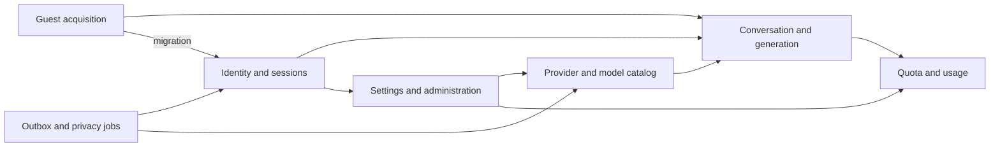
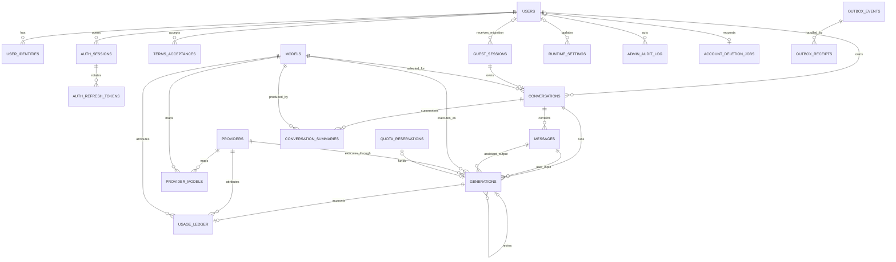
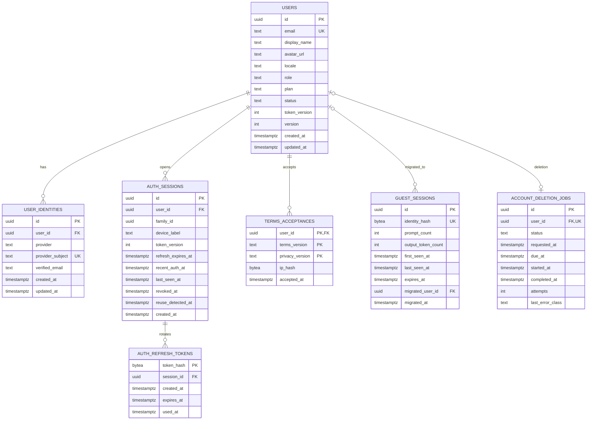
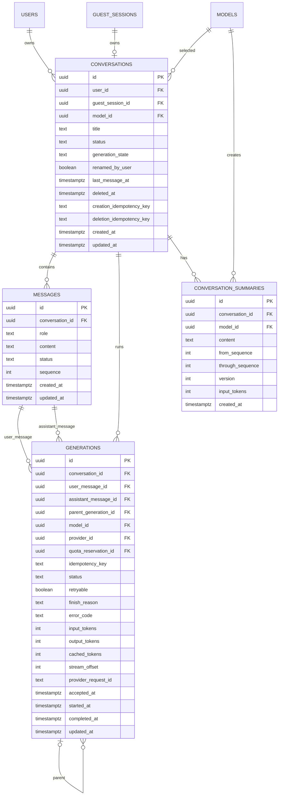
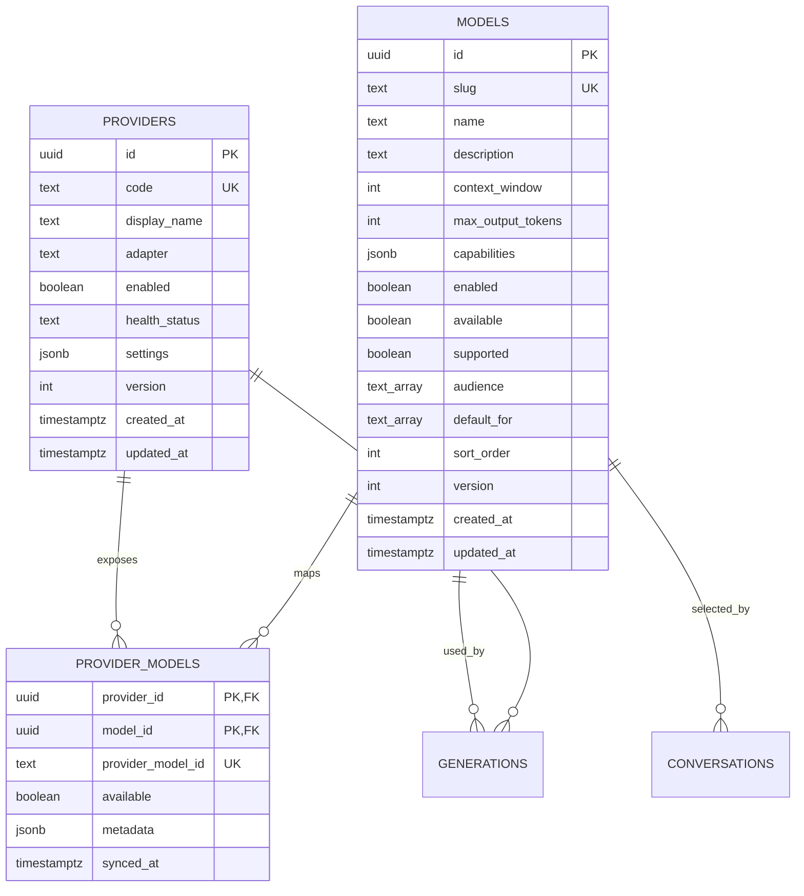
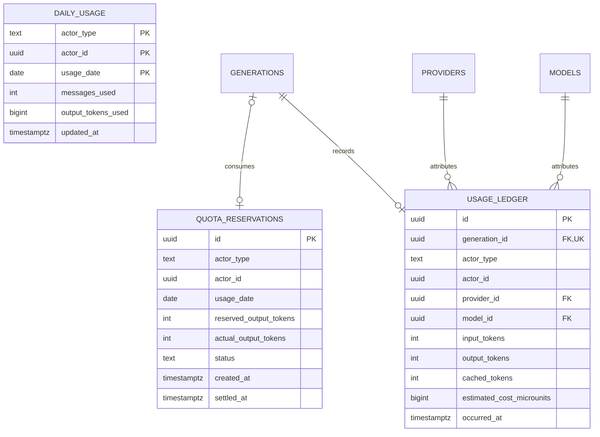
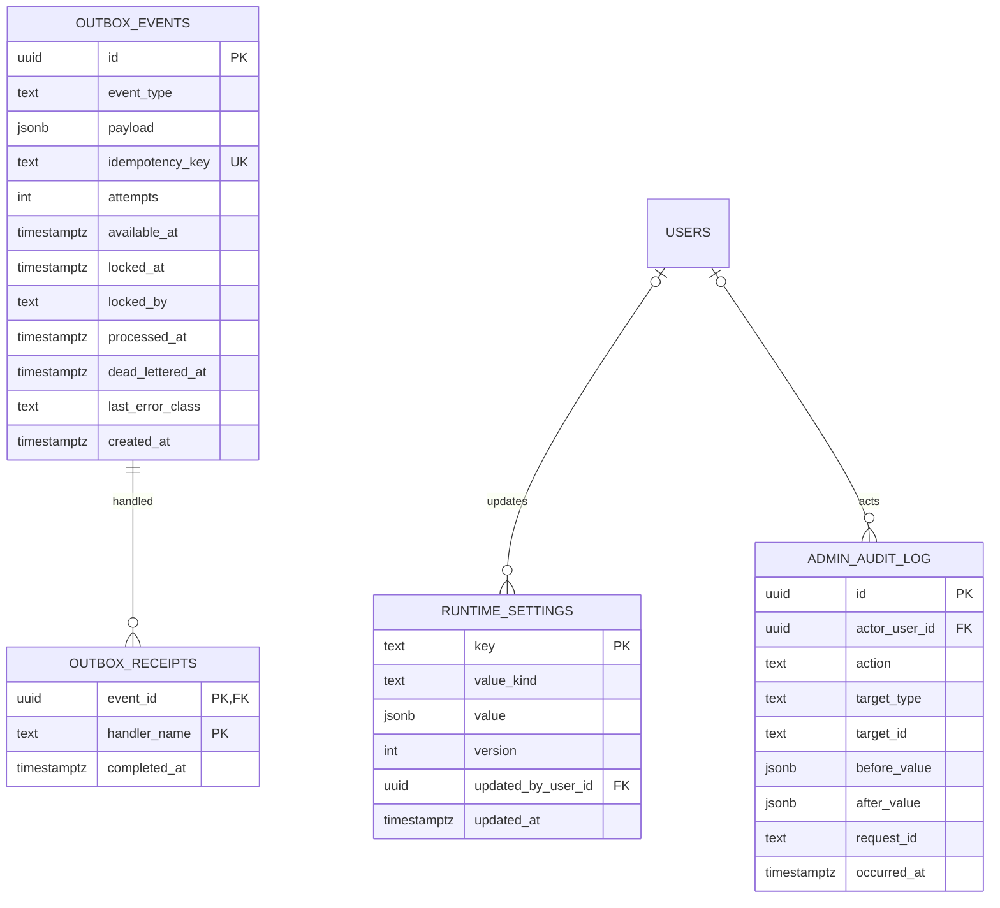

# Glazz Data Model and ERD

## Purpose and authority

This document explains the PostgreSQL model, its ownership boundaries, lifecycle,
and principal constraints. The executable source of truth is
[`apps/api/migrations`](../apps/api/migrations/); typed queries live under
`apps/api/internal/platform/store`.

PostgreSQL is the durable system of record. Redis data is intentionally absent from
the ERD because it is TTL-bound coordination/cache state, not relational authority.

## Domain map

## Complete relationship view

This diagram emphasizes cardinality. Polymorphic references such as
`daily_usage.actor_id` are application-validated and described separately because
PostgreSQL cannot express one foreign key to multiple actor tables.

## Identity and guest ERD

### Identity invariants

- Email uniqueness is case-insensitive through `lower(email)`.
- Google subject, not email, is the stable external identity key.
- One user has at most one identity per provider.
- Roles are `user` or `admin`; status is `active`, `deletion_pending`, or
  `disabled`.
- User and session token versions invalidate previously issued access tokens.
- Refresh tokens are stored as 32-byte hashes, never reusable plaintext.
- Active sessions and session families are indexed for revocation/reuse handling.
- Legal acceptance is versioned by both Terms and Privacy versions.
- IP evidence is an optional fixed-length hash, not a raw address.
- Guest identity is stored as a fixed-length hash and referenced through a signed
  cookie.
- `migrated_user_id` and `migrated_at` must be null or non-null together.
- A deletion job must be due no later than 24 hours after request.

## Conversation and generation ERD

`USERS`, `GUEST_SESSIONS`, and `MODELS` are shown as relationship endpoints here
and defined in their respective domain diagrams.

### Ownership invariants

- A conversation has exactly one owner: `user_id` XOR `guest_session_id`.
- One guest session can own at most one conversation.
- Registered ownership is indexed for stable `updated_at, id` pagination.
- Guest and registered create requests have separate owner-scoped idempotency
  indexes.
- User search uses a GIN index over the conversation title.
- Soft-deleted conversations are excluded from active-list indexes.

### Message invariants

- Message role is `user` or `assistant`.
- Message status is `pending`, `complete`, `cancelled`, or `failed`.
- `(conversation_id, sequence)` is unique and provides deterministic transcript
  ordering.
- Content has an upper bound of 200,000 characters.

### Generation invariants

- Every generation references distinct user and assistant messages.
- A partial unique index allows at most one `accepted` or `streaming` generation
  per conversation.
- `(conversation_id, idempotency_key)` is unique.
- Active states must not have `completed_at`; terminal states must have it.
- Terminal status is `completed`, `cancelled`, `failed`, or `rejected`.
- Finish reason is normalized to `stop`, `length`, `cancelled`, `safety`, or
  `error`.
- `stream_offset` persists progress for duplicate/gap handling.
- A retry points to its parent generation rather than branching the public
  conversation model.

### Summary invariants

Conversation summaries are modeled for bounded context construction:

- sequence range is explicit and valid;
- version is unique per conversation;
- the same range cannot be summarized twice;
- the producing model and input usage are retained;
- original messages remain authoritative.

## Provider and model catalog ERD

### Catalog invariants

- Provider adapter is `fake` or `openai_compatible`.
- Provider health is normalized to `unknown`, `healthy`, `degraded`, or
  `unavailable`.
- Model capability JSON must include `chatCompletions: true`.
- Audience/default arrays may contain only `guest` and `user`.
- Defaults must be a subset of audience.
- Partial unique indexes permit only one enabled guest default and one enabled user
  default.
- An enabled model must be supported and have an audience.
- Availability is tracked separately from enablement so an unavailable configured
  model can remain visible to administrators without being selected for new work.
- Provider model identifiers are isolated in the mapping table.

## Quota and usage ERD

### Polymorphic actors

`actor_type` plus `actor_id` identifies a guest or user. This is intentionally not
a database foreign key because the ID may refer to either `guest_sessions` or
`users`; `daily_usage` also permits the synthetic `global` actor. Services validate
the pair and lifecycle cleanup preserves only allowed anonymous aggregates.

### Accounting model

1. A command reserves a maximum output-token amount before provider work.
2. The reservation becomes `committed` with actual use or `refunded`.
3. `daily_usage` provides fast enforcement by actor/day.
4. `usage_ledger` records one immutable attribution per completed generation.
5. Global settings cap both concurrency and total output consumption.

Reservations prevent concurrent requests from each observing the same remaining
budget. Database constraints and transactions provide the durable barrier.

## Control, audit, and asynchronous work ERD

### Runtime-setting invariants

- Key names follow a constrained namespace.
- `value_kind` and the JSON value type must agree.
- version increments support optimistic concurrency.
- the updater reference may become null after account deletion while the setting
  remains.

Current keys include maintenance, guest/user limits, global concurrency/output
budget, the system prompt, and configured safety categories.

### Audit invariants

Audit events retain actor, action, target, before/after state, request correlation,
and time. Reads redact sensitive fields. Conversation content and secrets do not
belong in audit values.

### Outbox invariants

- Event type follows a stable namespaced format.
- Idempotency key is globally unique.
- processed and dead-lettered states are mutually exclusive.
- claim indexes ignore terminal rows.
- locks expire so another worker can recover abandoned work.
- per-handler receipts prevent an already completed effect from running again.

## Schema evolution

Migrations are append-only after release and include a checksum table to detect
edited historical migration content. Generated sqlc code is committed and checked
for drift.

Production changes follow expand/migrate/contract:

1. add backward-compatible structures;
2. deploy code that can read/write both states where required;
3. migrate or backfill data under observation;
4. switch all readers/writers;
5. remove obsolete structures in a later release.

Production migrations run as one pre-deploy job, not concurrently in every API
replica.

## Data lifecycle and privacy

| Data                       | Lifecycle                                                    |
| -------------------------- | ------------------------------------------------------------ |
| Guest session/conversation | expires unless migrated; worker removes unmigrated data      |
| User conversation/messages | retained until account/conversation deletion policy applies  |
| Auth refresh token hashes  | expire or are removed with session/user                      |
| OAuth/WS ticket state      | short TTL in Redis; not in PostgreSQL ERD                    |
| Generation and usage       | retained for user experience and accountable aggregate usage |
| Operational logs/traces    | no prompt/response bodies; retention selected in M6          |
| Audit records              | retained/redacted according to production policy             |
| Account deletion job       | durable until completed/operational retention expires        |
| Anonymous aggregates       | may remain when permitted and no longer identify the user    |

Final production retention periods, backup deletion behavior, and legal basis are
M6 decisions and must match the approved Privacy Policy.

## Backup and recovery expectations

The local Compose database is not a production durability design. Production
requires:

- managed encrypted storage and backups;
- point-in-time recovery appropriate to the selected provider;
- documented RPO/RTO;
- restore into an isolated environment;
- application-level integrity checks after restore;
- credential rotation and access audit;
- a successful restore drill before launch and on a recurring schedule.
