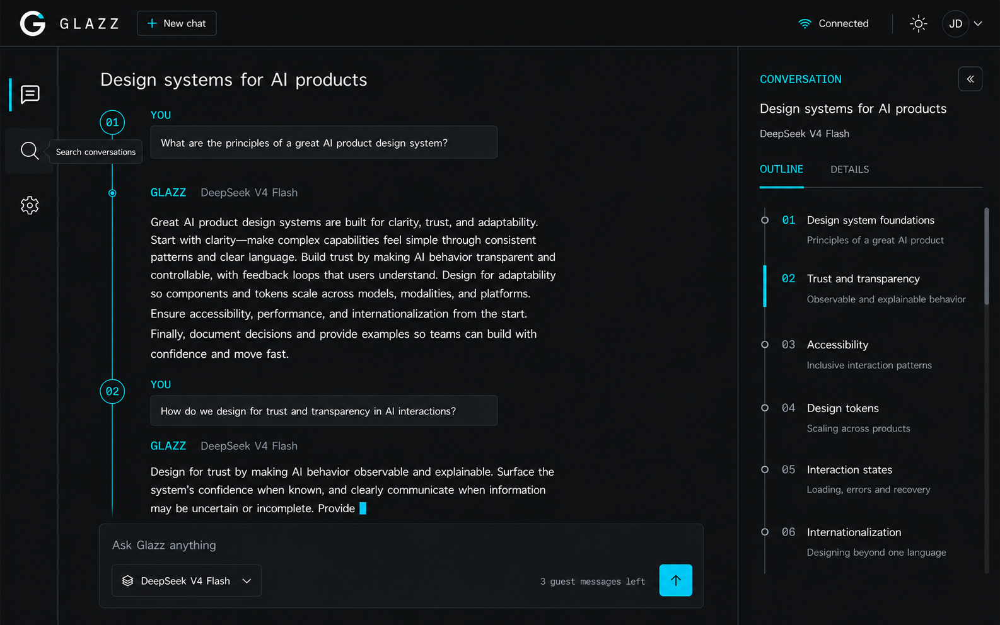

# Glazz UI Reimagination: Signal Workspace

**Status:** Approved design direction
**Scope:** Visual language, information architecture, and interaction model
**Canonical design source:** [`DESIGN.md`](../../DESIGN.md)

The V3 mockup is a directional reference, not the final source of truth. The
implementation changes two visible details from the image:

1. `New chat` is the first icon in the left navigation rail, not a header button.
2. The brand mark uses the exact original orange-UI logo geometry, recolored
   ice-white with its existing notch changed to cyan.

## 1. Why the current UI feels familiar

The current interface does not resemble Claude because of one color or component.
The similarity comes from the complete interaction grammar:

- a wide, permanently visible conversation sidebar;
- a narrow header with the model selector;
- a centered, mostly empty transcript;
- avatar-led user and assistant rows;
- a floating composer anchored at the bottom;
- warm dark surfaces with an orange primary action.

Changing only the palette would preserve that structure and therefore preserve the
same impression. The redesign needs a different spatial model and a distinctive
conversation language.

## 2. Proposed direction

### Signal Workspace

Glazz becomes a focused AI workspace organized around **conversation coordinates**:
each turn is a numbered point on a thin signal line. User prompts behave like
compact command bands; assistant responses remain open, editorial, and easy to
read. A narrow contextual lane exposes useful thread information without turning
the product into a developer console.

The intended personality is:

- precise, but not clinical;
- technical, but understandable to a general audience;
- premium through spacing, typography, and restraint rather than decoration;
- recognizable through cyan signal behavior and numbered conversation turns;
- dense enough to feel useful without becoming a dashboard.

The reference image contributes its disciplined grid, near-black surfaces, thin
rules, and electric cyan. It does **not** contribute the landing-page composition,
3D processor imagery, terminal language, or telemetry-heavy presentation.

## 3. Structural changes

| Current UI | Signal Workspace |
| --- | --- |
| 336 px permanent sidebar | 72 px navigation rail |
| Conversation history always visible | Searchable history drawer opened on demand |
| Model selector in the main header | Model selector integrated into the composer |
| Avatar-based message rows | Numbered turns connected by a signal spine |
| User message card | Compact horizontal prompt band |
| Assistant row with avatar | Unframed editorial answer block |
| Large undifferentiated canvas | Asymmetric workspace with transcript and context lane |
| Floating bottom composer | Composer aligned to the conversation grid |
| Connection and quota scattered in chrome | One connection state and subdued guest usage |

### Desktop composition

1. **Global header:** Glazz, connection state, theme, and profile. It spans the full
   viewport and establishes the product identity.
2. **Navigation rail:** new chat, current conversation, search, and settings.
   `New chat` is the first icon and does not appear again in the header. Labels
   appear through tooltips; the active destination uses a cyan signal mark.
3. **Conversation workspace:** title, lightweight thread metadata, numbered turn
   spine, prompts, and answers.
4. **Thread context lane:** compact conversation details and a navigable outline
   synchronized with the transcript.
5. **Composer:** multiline input, model selection, remaining guest use, and send
   action in one stable region.

### Mobile composition

- The navigation rail becomes a compact top bar.
- History and thread context become separate bottom sheets.
- The turn spine remains visible but moves closer to the viewport edge.
- The composer stays in normal document flow until it reaches the viewport bottom,
  then becomes sticky above the mobile safe area.
- The outline is not shown beside the conversation.
- Model selection and remaining use stay accessible from the composer.
- New chat remains available as a compact `Plus` action in mobile navigation.

## 4. Visual system

### Color palette

| Role | Token proposal | Value | Usage |
| --- | --- | --- | --- |
| Canvas | `--canvas` | `#07090A` | Main background |
| Surface | `--surface` | `#11171A` | Composer and prompt bands |
| Border | `--border` | `#263238` | Dividers and control boundaries |
| Primary text | `--text-primary` | `#EAFBFF` | Answers, labels, important controls |
| Muted text | `--text-muted` | `#78868D` | Metadata and secondary information |
| Signal | `--signal` | `#10D7E8` | Active turn, send action, focus, streaming |
| Healthy | `--healthy` | `#B7F34A` | Positive service state only |
| Destructive | `--destructive` | `#FF5D68` | Errors and destructive actions only |

Rules:

- Cyan is a functional signal, not a background wash.
- Chartreuse is reserved for confirmed healthy or successful states.
- No decorative gradients, glow clouds, purple AI styling, or orange carry-over.
- Thin borders establish hierarchy; cards are used only where framing is useful.
- Light mode must be designed independently rather than produced by color inversion.

### Typography

The concept uses three roles:

- **Display and brand:** Outfit, used with restraint;
- **Body and controls:** Work Sans for legibility;
- **Metadata:** JetBrains Mono, restricted to turn numbers, model names, times, and
  compact status values.

Monospace must not dominate answer content or make the interface feel like a
terminal.

### Shape and spacing

- Primary controls use 4 px radii; contextual panels may use up to 6 px.
- Transcript content is mostly unframed.
- Controls retain a minimum 44 x 44 px interactive target.
- The reading column targets 68-78 characters per line.
- Major regions align to a 12-column desktop grid and an 8 px spacing system.
- Dividers are subtle and structural, never decorative.

## 5. Conversation language

### User turn

- Numbered coordinate on the signal spine.
- Small `YOU`/localized actor label.
- Prompt displayed in a compact full-width band.
- Timestamp remains secondary and does not compete with the content.

### Assistant turn

- `GLAZZ / MODEL` metadata line.
- Answer rendered as open content without a surrounding chat bubble.
- Markdown remains sanitized; code and tables use purpose-built framed regions.
- Message actions appear on focus and through a persistent overflow control, never
  only on hover.

### Streaming

- The active answer receives a short vertical cyan rail.
- A restrained scan marker advances with streamed content.
- Layout dimensions are reserved so generation never shifts the composer.
- Reduced-motion mode replaces scanning motion with a static active indicator.
- Completion changes the active cyan rail to the established completed-state token.

## 6. Context lane

The right lane must answer practical user questions:

- Which model is answering?
- What topics and turns are already present in this thread?
- Where am I inside a long conversation?

The active `Outline` view is the dominant use of this space. It behaves as a
conversation minimap: every item links to a numbered turn, the currently visible
turn is highlighted, and a short prompt-derived label makes earlier content easy
to find. Initial labels can be derived deterministically without an additional LLM
request.

The lane contains exactly two views:

- **Outline:** the dense, independently scrollable conversation minimap;
- **Details:** model, creation and activity dates, rename/delete actions, and
  relevant privacy information.

The collapse control is a subtle icon inside the panel header. It must not protrude
past the panel boundary. The lane must not expose latency, internal IDs, provider
diagnostics, token telemetry, engineering tags, unsupported controls, or a user
presence state.

The remaining guest quota appears once as subdued composer metadata. It is not a
panel section, progress meter, or permanent focus for registered users. At
intermediate widths the lane collapses into a drawer before reducing the
transcript's readable width.

## 7. Brand mark

The Glazz mark reuses the exact geometry from the original orange application
screenshot. Its proportions, circular `G`, and existing contrasting notch are not
redrawn or reinterpreted:

- original primary geometry recolored ice-white;
- original orange notch recolored electric cyan;
- recognizable at favicon and navigation-rail sizes;
- no permanent glow, gradient, or illustrative treatment.

## 8. Required product states

The approved design must cover these states before implementation is considered
complete:

- empty conversation with useful starter actions;
- existing short and long conversations;
- active streaming, stop, completed, cancelled, and failed generation;
- reconnecting and replay-window recovery;
- guest quota approaching its limit;
- guest quota exhausted with Google sign-in prompt;
- authenticated user quota exhausted;
- model unavailable or changed;
- history drawer empty, loading, populated, and failed;
- long code blocks, tables, lists, and localized copy;
- keyboard focus, screen-reader announcements, 200% zoom, and reduced motion;
- 375, 768, 1024, and 1440 px viewport widths.

## 9. MVP guardrails

This redesign does not introduce:

- attachments or file upload;
- images or multimodal prompts;
- web search;
- tools or agents;
- public sharing or export;
- conversation tags;
- message editing or branching;
- developer telemetry or provider diagnostics.

The mockup is a visual concept. Any incidental visual detail that contradicts
`PROJECT.md`, the contracts, or the product invariants is non-binding.

## 10. Conversation search

The rail search icon opens a 360-400px drawer from the left. It does not add a
permanent search field to the workspace.

- Focus moves immediately to the search field.
- Results are grouped by relative date.
- Matching title text is highlighted.
- Arrow keys move through results; `Enter` opens one; `Escape` closes the drawer.
- Empty, loading, failed, and no-results states preserve stable dimensions.
- Initial filtering may use conversations already loaded in the client. Large
  histories use paginated backend search without changing the interaction.
- Closing search returns focus to its rail trigger.

## 11. Recommended implementation sequence

1. Implement the approved tokens, exact recolored logo asset, and visual baselines.
2. Implement the global header, navigation rail, and conversation-search drawer.
3. Implement the numbered transcript and all generation states.
4. Implement the responsive `Outline`/`Details` context lane.
5. Rebuild the composer without changing its existing product capabilities.
6. Complete mobile, keyboard, screen-reader, zoom, and reduced-motion behavior.
7. Run interaction, accessibility, visual-regression, and responsive checks.

## 12. Concept provenance

The mockup was generated with OpenAI ImageGen from the supplied current-state
screenshot and visual reference, then refined to remove unsupported product
features and developer-oriented diagnostics. It is an exploration artifact, not a
pixel-accurate implementation specification.
