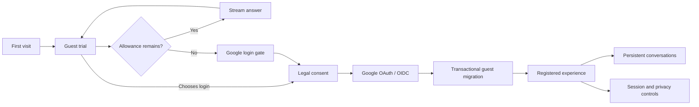
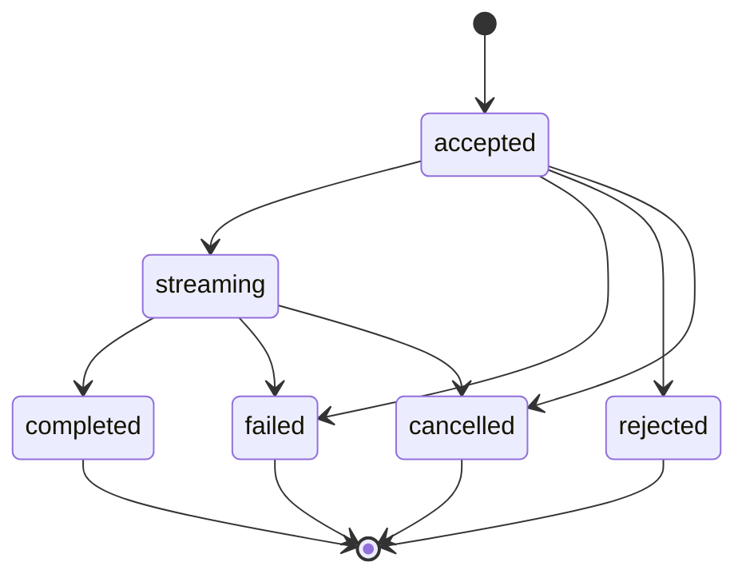

# Glazz Product Capabilities

## Purpose

This document presents the product surface as an implementation and portfolio
review. It describes what each actor can do, why the capability exists, where its
authoritative state lives, and which release gate proves it is ready.

The canonical product rules remain in [`PROJECT.md`](../PROJECT.md). Current task
status remains in [`TASKS.md`](../TASKS.md).

## Product thesis

Glazz uses a short, useful guest interaction to demonstrate value before requiring
identity. The durable product begins after registration: identity, conversation
history, model choice, usage, sessions, preferences, and privacy controls all
belong to a registered account.

The acquisition path and the durable path share the same generation engine but
have different ownership and quota policies:

## Actor model

### Guest

A guest is represented by a server-created session referenced through a signed,
HttpOnly cookie. The browser never receives a durable raw ownership identifier.
One guest session owns at most one conversation.

Default policy:

- four submitted prompts;
- 2,000 output tokens across the trial;
- no automatic reset;
- one short-lived conversation;
- 30-day configurable session TTL in development defaults;
- expired, unmigrated data removed by the worker.

Database safety constraints allow a higher operational ceiling than the default
runtime setting so administrators can tune the policy without a schema migration.
The runtime setting remains the effective product limit.

### Registered user

A registered user has a Google identity, one or more revocable browser sessions,
persistent conversations, preferences, usage, and privacy controls.

Default policy:

- 50 messages per UTC day;
- 50,000 output tokens per UTC day;
- one concurrent generation;
- access to models explicitly exposed to the `user` audience.

### Administrator

An administrator is a registered user with an elevated role. Administration is a
product capability, not a separate trust domain: every endpoint performs explicit
authorization, sensitive mutations require recent authentication, and changes
produce audit records.

## Capability matrix

| Capability                      |    Guest     | Registered | Admin | State / enforcement                  |
| ------------------------------- | :----------: | :--------: | :---: | ------------------------------------ |
| Start chat without login        |     Yes      |    N/A     |  N/A  | signed guest session                 |
| Persistent conversation history |      No      |    Yes     |  Yes  | PostgreSQL ownership                 |
| Multiple conversations          |      No      |    Yes     |  Yes  | conversation repository              |
| Search and lifecycle controls   |      No      |    Yes     |  Yes  | REST + soft-delete/archive state     |
| Realtime streaming              |     Yes      |    Yes     |  Yes  | WebSocket + persisted generation     |
| Cancel active generation        |     Yes      |    Yes     |  Yes  | cancellation signal + terminal state |
| Retry eligible generation       |   Limited    |    Yes     |  Yes  | latest failed/cancelled rule         |
| Select model                    | Default only |    Yes     |  Yes  | audience-filtered model catalog      |
| View quota                      |     Yes      |    Yes     |  Yes  | runtime settings + usage state       |
| Google login and migration      |     Yes      |    N/A     |  N/A  | OAuth + transactional migration      |
| Manage sessions                 |      No      |    Yes     |  Yes  | rotating refresh families            |
| Change locale/theme             |    Local     |    Yes     |  Yes  | browser + persisted locale           |
| Request account deletion        |      No      |    Yes     |  Yes  | recent auth + deletion job           |
| Manage model exposure           |      No      |     No     |  Yes  | optimistic versioning + audit        |
| Manage runtime settings         |      No      |     No     |  Yes  | typed setting registry + audit       |
| Change user roles               |      No      |     No     |  Yes  | recent auth + last-admin guard       |
| View aggregate operations       |      No      |     No     |  Yes  | redacted aggregate queries           |
| View audit trail                |      No      |     No     |  Yes  | append-only audit records            |

## Chat behavior

### Conversation lifecycle

Registered users can:

1. create a conversation using an idempotency key;
2. select any available model exposed to their audience;
3. stream turns over WebSocket;
4. rename a conversation manually;
5. search and paginate history;
6. archive and restore;
7. delete idempotently.

Guests use a single server-associated conversation. Migration transfers that
conversation to the newly authenticated account exactly once.

### Generation lifecycle

Each turn persists a user message, an assistant placeholder, and a generation
record. Generation state is explicit:

Only one generation may be active per conversation. Idempotency keys prevent
network retries from creating duplicate generations. Server event offsets and
sequences allow clients to ignore duplicate deltas and detect gaps.

### Response presentation

- incremental Markdown/GFM rendering;
- code blocks with copy action;
- cancellation with retained partial content when available;
- retry for the latest eligible failed/cancelled generation;
- jump-to-latest affordance for long transcripts;
- reconnect, resync, quota, maintenance, and provider failure states;
- input method editor-safe submission;
- malicious Markdown remains inert.

## Identity and account behavior

### Login

Google OAuth 2.0 authorization code with PKCE establishes the external identity.
OIDC verification binds the account to Google's stable subject identifier and a
verified email. Login consumes single-use state and only permits known return
locations.

When a guest logs in:

1. the callback verifies Google identity;
2. an existing account is found or a new account is created;
3. current legal versions are recorded;
4. the guest conversation is migrated transactionally and idempotently;
5. an auth session and rotating refresh family are created;
6. the guest cookie is retired.

### Session management

Users can inspect devices/sessions and revoke one. Revoking the current session
logs the browser out. Access JWTs are short lived; refresh-token rotation limits
the effect of token theft and detects replay.

### Account deletion

Deletion requires recent authentication and explicit confirmation. Acceptance:

- account status changes to deletion-pending;
- all sessions are revoked immediately;
- login is blocked while deletion is pending;
- a durable job removes account-owned content within 24 hours;
- permitted anonymous operational aggregates may remain;
- failures are retryable and observable without exposing content.

## Model and provider behavior

The public model catalog is an internal product catalog, not a raw copy of the
provider response.

A model is offered only when:

- the adapter supports its required chat capability;
- an administrator enables it;
- it is assigned to the actor's audience;
- it is currently available for new generations;
- defaults remain unique per audience.

Provider availability can change without deleting the configured product model.
This lets an administrator see and remediate an unavailable model while preventing
new chat selection.

The domain accepts normalized provider events and errors. Provider request/response
types do not cross the adapter boundary.

## Runtime administration

Runtime settings are typed, versioned, cached, and auditable. Current settings
cover:

- maintenance mode;
- guest and registered message/output limits;
- global concurrent-generation and output-token budgets;
- system prompt;
- configured input/output safety categories.

Updates use optimistic concurrency. A stale admin page receives a conflict rather
than silently overwriting a newer value.

## Localization, accessibility, and PWA

- Complete English and Spanish dictionaries with parity tests.
- Browser locale detection with English fallback.
- Persisted locale for authenticated accounts.
- Light, dark, and system themes.
- Keyboard-accessible chat, menus, dialogs, settings, and destructive flows.
- Focus containment and restoration for dialogs.
- WCAG 2.2 AA target and automated axe checks.
- Responsive acceptance at 375, 768, 1024, and 1440 pixels.
- 200% zoom/reflow acceptance.
- Installable PWA metadata and navigation fallback.
- No service-worker caching of API responses or chat transcripts.

## Operational capabilities

- Liveness and dependency-aware readiness endpoints.
- Structured JSON logs with request and trace correlation.
- OpenTelemetry traces and Prometheus metrics.
- Provider timeout/retry/circuit-breaker behavior.
- PostgreSQL outbox with retries, receipts, and dead-letter state.
- Hourly account-purge and guest-cleanup maintenance cycle.
- Provider model sync at worker startup and through outbox commands.
- Graceful API, worker, WebSocket, and generation cancellation.

## Explicit MVP non-goals

The following are intentionally excluded:

- file or image upload;
- image generation;
- web search;
- tool execution or autonomous agents;
- public conversation sharing;
- transcript export;
- message editing;
- conversation branching;
- billing or paid subscription enforcement;
- native mobile applications;
- anonymous multi-conversation history;
- multiple authentication providers;
- provider-specific features exposed directly to clients.

These exclusions protect the core ownership, realtime, quota, security, and
operational work from uncontrolled scope expansion.

## Delivery state

Implemented and accepted through M4:

- contract-first API and WebSocket definitions;
- monorepo and pinned toolchain;
- data, identity, session, quota, telemetry, and worker foundations;
- complete chat backend and provider adapter;
- responsive bilingual frontend;
- account/settings/admin journeys;
- deterministic E2E and live-provider preview smoke.

M5 currently hardens the release candidate. M6 remains responsible for selecting
production hosting/provider, provisioning environments, backups/restores, domains,
production OAuth, observability ownership, legal approval, staged rollout, and the
go-live decision.
