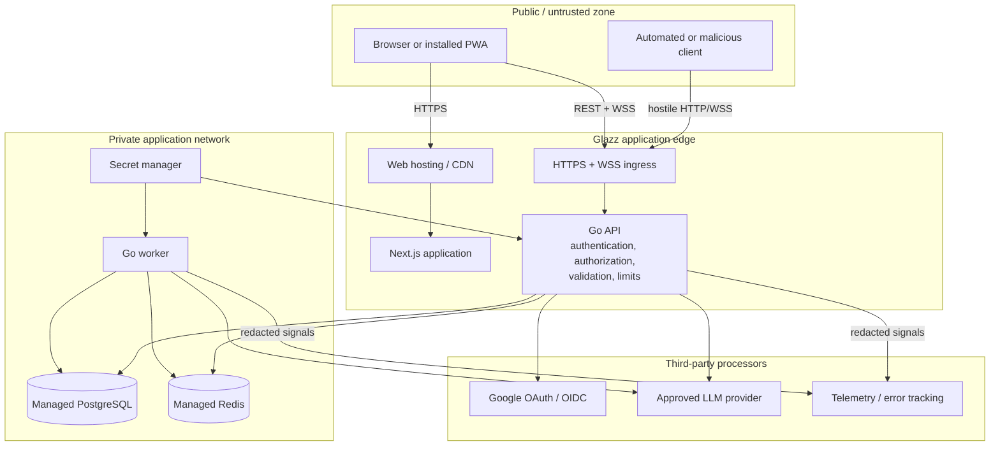
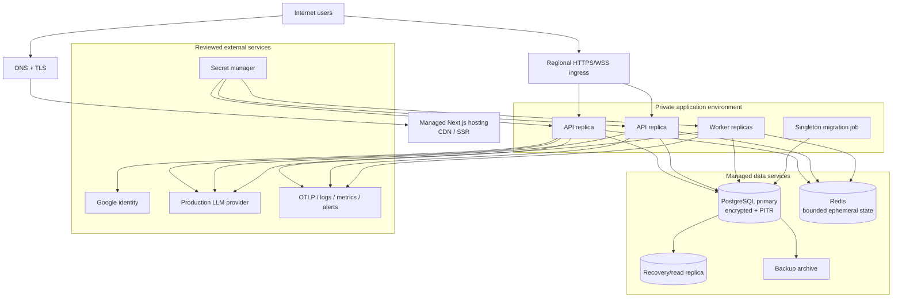

# Glazz Security and Production Readiness

## Purpose

This document presents the security architecture, control evidence, residual risks,
and path from the current release candidate to public production. It is intended
for technical review and portfolio evaluation; it is not a claim of certification
or a substitute for an independent security assessment.

The canonical product gates are in [`PROJECT.md`](../PROJECT.md), current execution
status is in [`TASKS.md`](../TASKS.md), and the initial detailed threat analysis is
in [`docs/threat-model/m0-threat-model.md`](./threat-model/m0-threat-model.md).

## Current posture

- M4 is released as `v0.4.0`.
- M5/Phase 9 acceptance is complete, including functional, accessibility, visual,
  security, load, dependency-failure, privacy, performance, contract, and GitHub
  CI gates.
- M5 is published as annotated tag `v0.5.0`.
- Production hosting and the production LLM provider are not selected.
- The current Docker Compose environment is a development/preview topology.

Glazz must not be represented as production-ready until every M5 and M6 acceptance
gate is complete.

## Security principles

1. Treat browser input, conversation content, model output, and provider metadata
   as untrusted.
2. Keep identity verification, authorization, quota, safety, and provider
   credentials on the server.
3. Store durable truth in PostgreSQL; loss of Redis must be recoverable or fail
   closed.
4. Acknowledge state-changing realtime commands only after durable acceptance.
5. Use least privilege and explicit actor ownership at every resource boundary.
6. Make sensitive sessions revocable and replay detectable.
7. Avoid prompt/response content in operational telemetry.
8. Bound resource consumption per guest, user, and global service.
9. Make administrative policy typed, versioned, validated, and auditable.
10. Require evidence, not implementation presence, before accepting a release gate.

## Trust-boundary diagram

Production network policy should allow PostgreSQL and Redis only from application
identities/private networks. Provider, Google, and telemetry are outbound
dependencies with separately reviewed data-processing boundaries.

## Identity and session controls

### Google OAuth/OIDC

- authorization-code flow with PKCE;
- unpredictable state stored server-side with a short TTL;
- state consumed once at callback;
- redirect targets restricted to known application routes;
- issuer, audience, signature, expiry, subject, and verified-email claims checked;
- stable provider subject used as the identity key;
- deterministic OAuth mode forbidden by production configuration.

### Access and refresh tokens

- 15-minute default access JWT lifetime;
- explicit issuer and audience validation;
- pinned signing algorithm and key identifier;
- key rotation model documented in ADR-0003;
- 30-day default rotating refresh-session lifetime;
- refresh tokens stored only as SHA-256-sized hashes;
- token rotation marks the previous token used;
- replay/reuse revokes the token family;
- user/session token versions support global/session invalidation;
- logout and account deletion revoke server-side sessions.

### Browser cookie policy

Auth and guest cookies are HttpOnly. Production requires:

- `Secure=true`;
- `SameSite=Lax` unless a reviewed flow requires stricter/different behavior;
- the narrowest viable domain/path;
- explicit expiration;
- HTTPS-only callbacks and application URLs.

Cookie-authenticated mutations require CSRF validation. CORS is an allowlist, not
`*`, and WebSocket handshakes validate Origin.

### Sensitive operations

Recent authentication is required for account deletion, sensitive role changes,
and comparable high-impact actions. The last active administrator cannot be
demoted through a concurrent race.

## Authorization model

| Resource            | Authorization rule                                              |
| ------------------- | --------------------------------------------------------------- |
| Guest session       | signed cookie resolves to active, unmigrated server session     |
| Conversation        | exactly one matching guest or user owner                        |
| Messages/generation | inherited through authorized conversation                       |
| Model catalog       | actor receives only enabled, supported, audience-exposed models |
| User sessions       | current authenticated user only                                 |
| Account deletion    | current user + recent auth + explicit confirmation              |
| Admin APIs          | active admin + endpoint-specific recent-auth/version rules      |
| Audit/usage         | admin only; content excluded/redacted                           |

Handlers do not accept a client-provided owner ID as proof. Queries include the
actor boundary, preventing an IDOR check from depending on a previous read.

## Realtime security

- the browser obtains a single-use opaque WebSocket ticket over authenticated HTTP;
- ticket lifetime is at most 30 seconds;
- Redis consumption is atomic;
- WebSocket Origin is allowlisted;
- commands use a versioned envelope, request correlation, event ID, and idempotency
  key;
- payload sizes and message content lengths are bounded;
- one active generation per conversation is enforced durably;
- heartbeat detects abandoned connections;
- read/write/replay/heartbeat loops are cancelled and joined on disconnect;
- slow-client queues and replay windows are bounded;
- reconnect uses ordered sequence numbers or explicit REST resync;
- client cancellation cannot target another actor's generation.

## AI and provider controls

The model is not an authority. Prompt injection cannot grant application access,
change quota, expose secrets, or invoke tools because the MVP offers no tool
execution and all control decisions remain outside the model.

Provider controls:

- credentials exist only in API/worker configuration;
- provider request/response types terminate at the adapter;
- supported capabilities are validated before catalog exposure;
- model discovery does not auto-enable a model;
- timeout, retryability, circuit-breaker, and failure classes are normalized;
- per-actor and global token/concurrency limits bound spend;
- system prompt is configurable but never treated as a safety boundary;
- input/output category policy is separate from prompt instructions;
- provider privacy, retention, region, training use, and commercial multi-user
  rights must be approved before production.

OpenCode Go is development-only. Its availability or subscription does not satisfy
the production-provider gate.

## Abuse and resource controls

### Guest controls

- signed opaque identity;
- limited prompt and output-token allowance;
- one conversation;
- no automatic allowance reset;
- TTL and cleanup;
- IP/device signals may augment, but never replace, server-side allowance;
- global provider budget limits damage from identity rotation.

### Registered controls

- daily message and output-token limits;
- one default concurrent generation;
- actor-scoped rate limits;
- idempotency prevents retry amplification;
- session revocation and disabled/deletion-pending status stop access.

### Service-wide controls

- global concurrent-generation limit;
- global output-token budget;
- provider circuit breaker;
- HTTP timeout and maximum body size;
- database pool bounds;
- bounded WebSocket/replay queues;
- maintenance mode;
- readiness fails when required protection dependencies are unavailable.

## Data protection and privacy

### Data minimization

- provider credentials never reach the browser;
- raw refresh tokens are not stored;
- guest identity and optional IP evidence are hashed;
- audit reads redact sensitive fields;
- admin usage is aggregate and excludes conversations;
- logs, traces, metrics, analytics, and error events exclude prompts/responses;
- OAuth/WS state is short lived.

### Retention and deletion

- expired unmigrated guest sessions are removed by the worker;
- account deletion revokes sessions immediately;
- purge is represented by a durable retryable job;
- due time is constrained to no more than 24 hours after request;
- user-owned conversation/auth/identity data cascades where appropriate;
- permitted non-identifying aggregates may be retained;
- production retention periods and backup-deletion implications require legal and
  M6 approval.

### LLM processing

Conversation content necessarily leaves the Glazz private boundary when sent to the
selected provider. Production approval must document:

- what content is sent;
- provider retention and training policy;
- subprocessors and processing region;
- encryption in transit;
- deletion/support procedures;
- incident notification;
- contractual rights for a public multi-user service.

## Application control matrix

| Threat                             | Preventive controls                                        | Detective/recovery controls            | Remaining M5 evidence          |
| ---------------------------------- | ---------------------------------------------------------- | -------------------------------------- | ------------------------------ |
| OAuth login CSRF/code interception | state, PKCE, exact callback/return allowlist               | callback errors and correlated logs    | adversarial OAuth review       |
| Refresh-token theft/replay         | HttpOnly, hash storage, rotation, short access TTL         | family reuse detection and revocation  | browser/session abuse tests    |
| Cross-site request forgery         | SameSite + CSRF token + Origin/CORS policy                 | rejected-request metrics               | manual bypass review           |
| WebSocket cross-site hijack        | single-use ticket + Origin validation                      | connection/rejection metrics           | handshake matrix               |
| IDOR                               | actor-scoped repository queries                            | forbidden/not-found metrics            | cross-user endpoint sweep      |
| Admin privilege escalation         | role middleware, recent auth, last-admin guard             | redacted audit log                     | concurrency and endpoint sweep |
| Guest quota bypass                 | signed identity, durable usage/reservation, runtime limits | quota/global-budget metrics            | adversarial identity rotation  |
| Duplicate generation/spend         | idempotency + one-active index + reservation               | ledger/reconciliation                  | reconnect/load storm           |
| XSS from model output              | safe Markdown rendering, no raw HTML execution, CSP target | E2E malicious Markdown                 | final CSP/browser review       |
| Secret disclosure                  | server-only config, secret scan, redaction                 | Gitleaks and audit                     | production secret-store review |
| Dependency compromise              | exact pins, lockfiles, immutable Actions                   | vulnerability/secret CI                | M5 dependency review           |
| Provider outage/latency            | timeout, resilience wrapper, circuit breaker               | normalized errors and duration metrics | load/failure matrix            |
| Data loss                          | transactions, outbox, durable generation state             | integrity tests                        | backup/restore drill in M6     |
| Content leakage via telemetry      | no-content logging rule, bounded attributes                | privacy inspection                     | QA-008 trace/log review        |
| Resource exhaustion                | size/time/pool/queue/concurrency/token bounds              | saturation metrics/readiness           | QA-006 soak                    |

## Secure configuration

Configuration is explicit and validated at startup. Production must:

- inject values from a secret/configuration manager;
- never use `.env.example` or `.env.test.example`;
- set `GLAZZ_ENV=production`;
- reject `OAUTH_TEST_MODE=true`;
- use non-development signing material and unique cookie keys;
- use HTTPS issuer, web, API, callback, and allowed origins;
- set secure cookie policy;
- configure trusted proxies narrowly;
- require encrypted PostgreSQL/Redis connections;
- keep migration privileges separate from runtime privileges where supported;
- scope provider and telemetry tokens to the minimum capabilities;
- rotate keys with an owned procedure;
- prevent public access to metrics and private stores.

Startup must fail for missing declared keys, invalid durations/URLs, unsafe
production combinations, or incomplete provider/OAuth configuration.

## Supply-chain and CI controls

- exact Node, pnpm, Go, dependency, and container image versions;
- lockfiles and Go checksums committed;
- GitHub Actions pinned to immutable commit SHAs;
- generated contract/sqlc drift detection;
- formatting, lint, typecheck, tests, race, build, and E2E gates;
- Gitleaks scan over repository history;
- Go vulnerability analysis;
- production container builds;
- Context7 plus official upstream verification before dependency changes;
- ADRs for architecture/security-sensitive choices.

M5 adds an explicit security review with no open critical/high findings and
ownership for accepted medium findings.

## Observability without content exposure

Allowed high-value attributes:

- request/trace ID;
- route template, method, status, latency;
- actor type, not email or raw actor ID where unnecessary;
- normalized error code/class;
- model/provider internal identifier;
- token counts and estimated aggregate cost;
- generation status and duration;
- WebSocket connection/reconnect/replay outcomes;
- outbox backlog/attempt state.

Prohibited attributes:

- prompt or response text;
- system prompt content;
- cookies, JWTs, OAuth codes, state, PKCE verifier;
- provider API keys;
- refresh tokens or hashes;
- raw email/IP;
- unrestricted request/response bodies.

QA-008 must inspect real logs, traces, metrics, browser errors, and deletion
artifacts rather than relying only on code review.

## Target production topology

The selected vendor may combine boxes, but trust and operational responsibilities
must remain explicit.

## Production release plan

### M5: prove the application release candidate

1. **Visual regression:** viewport, theme, locale, and core state matrix.
2. **Security review:** OAuth, CSRF, tokens, WebSocket, IDOR, admin, guest abuse,
   XSS/CSP, secrets, and dependencies.
3. **Realtime load/soak:** normal load, slow consumers, reconnect storms,
   cancellation, provider latency, and bounded memory/goroutines.
4. **Dependency failure matrix:** PostgreSQL, Redis, provider, telemetry, worker,
   and network failures.
5. **Privacy/deletion:** inspect signals and prove guest/account cleanup.
6. **Web performance:** bundle, hydration, CLS, long transcript, code rendering.
7. **Contract compatibility:** compare implementation, generated types, examples,
   and mobile-future needs.

All M5 evidence is accepted. The release commit passed GitHub presubmit, E2E, and
security and is published as annotated tag `v0.5.0`.

### M6: build and approve production

1. Select API/PostgreSQL/Redis hosting using WebSocket, region, private network,
   backup, cost, scaling, and observability evidence.
2. Select an LLM provider after commercial, privacy, capacity, quality, cost, and
   streaming approval.
3. Record both decisions in ADRs.
4. Provision reproducible staging and production environments.
5. Configure domains, TLS, OAuth, cookies, CORS, CSP, proxy trust, and secret
   management.
6. Implement backup/PITR and pass a restore drill.
7. Establish dashboards, SLO alerts, on-call ownership, and runbooks.
8. Execute migration, rollout, rollback, and incident exercises.
9. Complete legal review for Terms and Privacy Policy.
10. Run staged canary traffic and hold a formal go/no-go review.

## Operational objectives

Current product targets:

| Objective              | Target / decision state                                 |
| ---------------------- | ------------------------------------------------------- |
| Availability           | 99.5% initial target                                    |
| First response content | p95 under 3 seconds excluding declared provider outages |
| Accessibility          | WCAG 2.2 AA                                             |
| Account deletion       | complete within 24 hours                                |
| CLS                    | below 0.1                                               |
| RPO                    | select with hosting provider in M6                      |
| RTO                    | select and prove with restore exercise in M6            |
| Error budget / on-call | define from production SLO in M6                        |

Load-test evidence must refine connection, request, generation, database-pool, and
provider budgets before capacity is purchased.

## Deployment and rollback strategy

- build one immutable API/worker image and one immutable web artifact;
- promote the same artifact through staging and production;
- run backward-compatible migrations once before application rollout;
- use rolling or canary API deployment with readiness gating;
- preserve protocol compatibility across the rollout window;
- deploy frontend only when it remains compatible with both old/new API replicas;
- stop or roll back application traffic independently from schema contraction;
- use feature/runtime settings for maintenance and controlled exposure;
- perform destructive schema contraction only in a later confirmed release.

Every release records artifact versions, migration state, configuration version,
provider catalog/defaults, verification evidence, owner, and rollback point.

## Incident and recovery runbooks required

Before launch, operators need reviewed procedures for:

- provider outage, latency, or quota exhaustion;
- PostgreSQL failover and restore;
- Redis loss or saturation;
- elevated auth/refresh reuse failures;
- WebSocket connection storm;
- leaked/rotated JWT, cookie, provider, OAuth, and database credentials;
- disabling a compromised model/provider;
- account-deletion backlog;
- outbox dead letters;
- rollback after migration;
- suspected content leakage;
- Google OAuth callback failure.

Runbooks must include detection, immediate containment, customer impact,
verification, rollback/recovery, communication ownership, and post-incident
follow-up.

## Go-live evidence checklist

- [x] All M5 acceptance rows are green and `v0.5.0` is published.
- [ ] Hosting and provider ADRs are approved.
- [ ] Staging mirrors production security and networking behavior.
- [ ] Production OAuth and HTTPS callback pass.
- [ ] JWT/cookie/CSRF/CORS/CSP/WebSocket policies pass security review.
- [ ] Database migrations and rollback are rehearsed.
- [ ] Backup, PITR, and isolated restore drill pass.
- [ ] Load model fits purchased capacity with headroom.
- [ ] Provider failure and budget circuits behave as designed.
- [ ] Logs/traces/errors contain no conversation content or secrets.
- [ ] Account and guest deletion evidence meets policy.
- [ ] Dashboards, alerts, runbooks, and on-call ownership are active.
- [ ] Terms and Privacy Policy are legally approved.
- [ ] Canary rollout and rollback criteria are approved.
- [ ] Final go/no-go decision is recorded.

Unchecked items are real release blockers, not optional recommendations.
