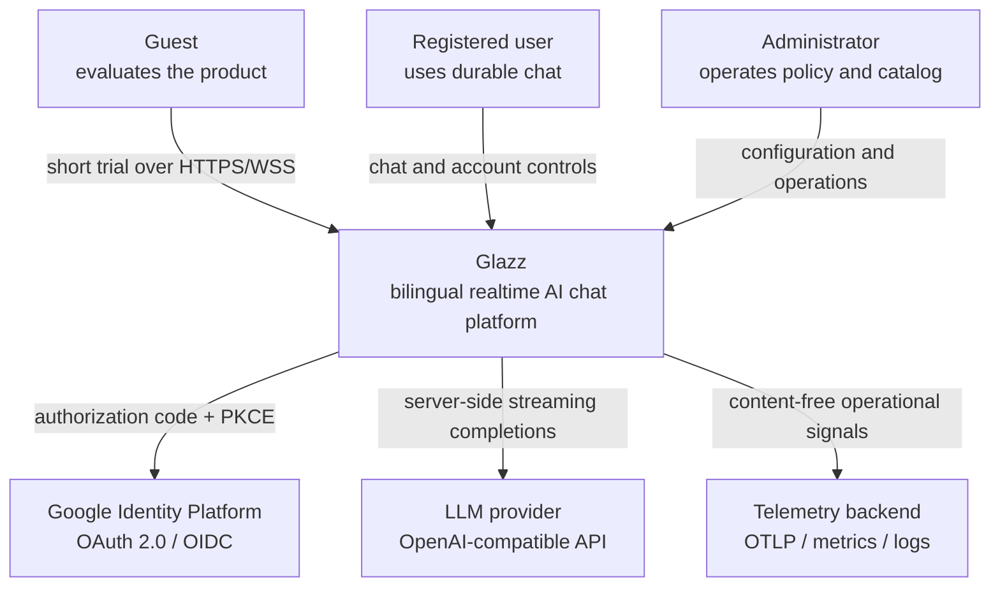
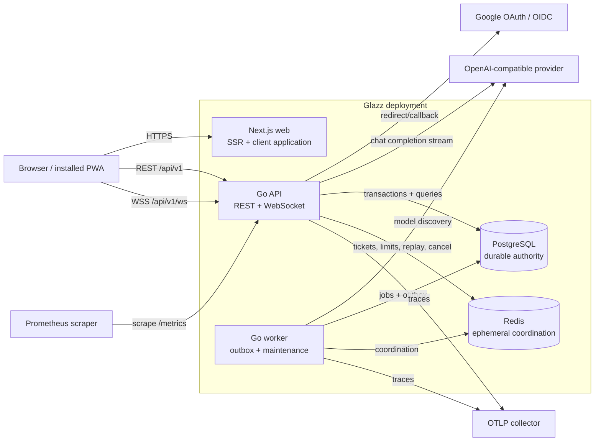
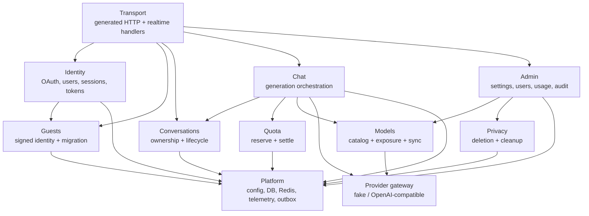
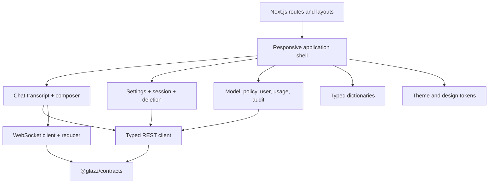
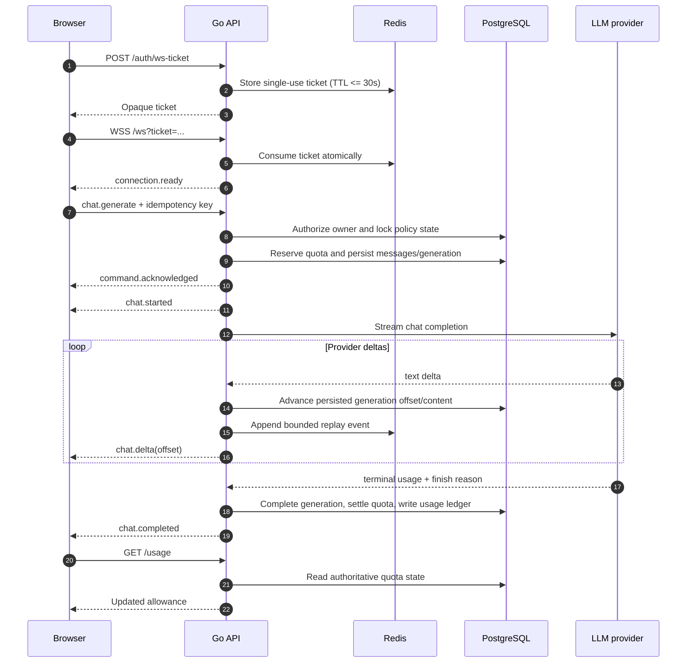
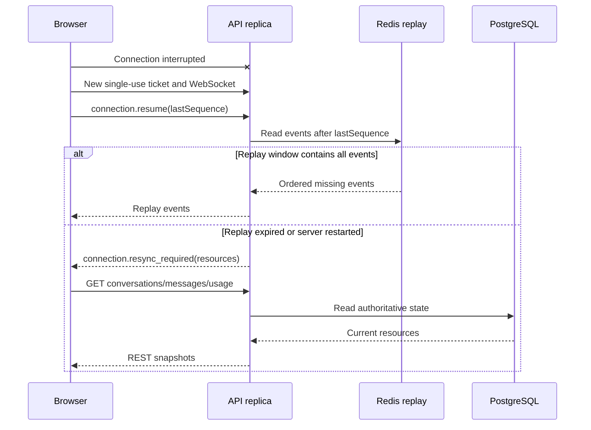
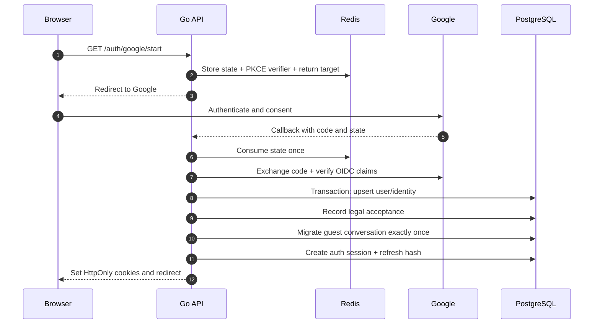
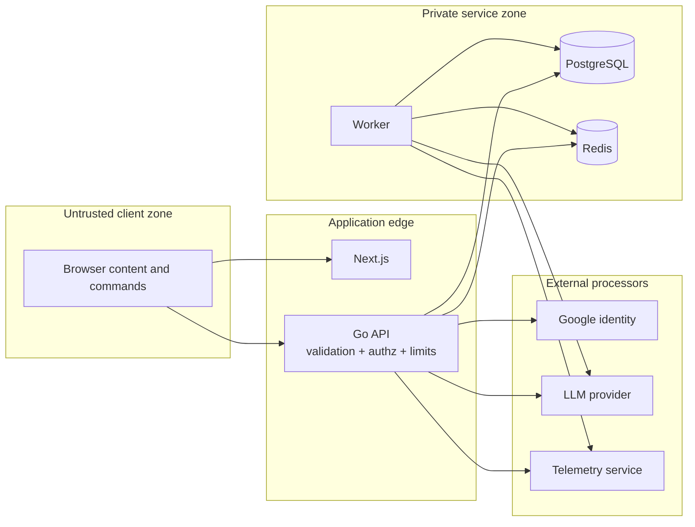

# Glazz Technical Architecture

## Document role

This is the review-oriented architecture narrative for Glazz. It explains the
system through C4-inspired context/container views, component responsibilities,
critical sequences, quality attributes, and tradeoffs.

[`ARCHITECTURE.md`](../ARCHITECTURE.md) remains the canonical detailed
specification. Executable truth lives in OpenAPI, AsyncAPI, SQL migrations, and
tests.

## Architecture drivers

The design is shaped by these constraints:

1. Guests must receive useful value before login, but abuse and provider cost must
   remain bounded.
2. Registered users need durable ownership, history, sessions, preferences, usage,
   and deletion.
3. Streaming should feel immediate while reconnects, retries, and duplicate client
   commands remain correct.
4. The LLM provider is replaceable; OpenCode Go is development-only and the
   production provider is intentionally undecided.
5. The browser must never receive provider credentials.
6. Runtime policy changes require validation, concurrency control, and audit.
7. Operational telemetry must exclude prompt and response content.
8. The system must move from local Compose to managed production services without
   changing domain contracts.
9. A small team must be able to understand and operate the codebase.

These drivers favor a modular monolith with explicit process boundaries over
premature microservices.

## System context

The browser trusts Glazz, not the LLM provider. Google establishes identity but
does not own application authorization. Glazz maps verified identity to its own
user, role, plan, status, and session model.

## Container view

### Next.js web

Responsibilities:

- render guest, registered, settings, and admin surfaces;
- consume generated OpenAPI types;
- maintain WebSocket connection/replay state;
- reduce ordered deltas idempotently;
- render safe Markdown/GFM;
- manage theme, locale, responsive layout, focus, and PWA states;
- recover authoritative resources through REST after a resync request.

The web application does not contain provider keys, quota authority, authorization
decisions, or durable generation state.

### Go API

Responsibilities:

- expose versioned REST and WebSocket interfaces;
- create and validate guest identity;
- execute Google OAuth/OIDC and application session policy;
- authorize resource ownership and administration;
- reserve/settle quota transactionally;
- persist messages and generation lifecycle;
- call the provider gateway and stream normalized events;
- publish bounded replay and coordination state to Redis;
- expose readiness, metrics, traces, and structured logs.

The API is a modular monolith. It keeps cross-slice transactions straightforward
while package boundaries preserve future extraction options.

### Go worker

The API and worker use the same module and immutable container image but different
commands. The worker:

- synchronizes live provider models at startup;
- handles `models.sync` outbox events;
- claims outbox rows with retry and dead-letter policy;
- records per-handler receipts for idempotent delivery;
- purges due account-deletion jobs;
- removes expired, unmigrated guest data;
- shuts down on process cancellation.

### PostgreSQL

PostgreSQL is the correctness boundary. It stores:

- application identity and auth sessions;
- guest ownership and migration;
- conversations, messages, generations, and summaries;
- model/provider catalog and mapping;
- quota reservations, daily usage, and immutable usage ledger;
- typed runtime settings;
- outbox events/receipts;
- audit records and deletion jobs.

Constraints and partial unique indexes enforce invariants that must remain correct
under concurrency, including one active generation per conversation and one
default model per audience.

### Redis

Redis holds state whose loss is recoverable or must fail closed:

- short-lived OAuth and WebSocket tickets;
- rate-limit and concurrency coordination;
- cancellation signals;
- bounded realtime replay;
- cross-instance notifications;
- cache entries with explicit invalidation.

Conversation and generation truth never depends solely on Redis.

### Provider gateway

The gateway translates the domain request into an OpenAI-compatible Chat
Completions request and emits normalized deltas, terminal usage, finish reasons,
and error classes.

The adapter owns provider authentication, request identifiers, timeouts, retry
classification, and model discovery. Provider-specific shapes cannot leak into the
public API or domain services.

## Backend component view

Packages are organized by vertical capability under `apps/api/internal`. Services
own business rules, typed sqlc repositories own SQL interaction, transport
handlers map domain results to contract types, and `cmd/api`/`cmd/worker` perform
explicit dependency injection.

## Frontend component view

Server rendering supplies the application entry point. Interactive chat,
connection state, transcript reduction, settings, and admin operations are client
capabilities where browser state is required. Client-heavy dependencies are kept
out of routes that do not need them.

## Contract-first boundary

Glazz defines interfaces before implementation:

- OpenAPI 3.1 describes REST endpoints, resources, cookies, errors, pagination,
  optimistic concurrency, and idempotency.
- AsyncAPI 3.0 describes the single WebSocket channel, commands, events,
  envelopes, sequence numbers, replay, heartbeat, and terminal outcomes.
- `openapi-typescript` generates browser compile-time types.
- `oapi-codegen` generates Go server types and interfaces.
- fixtures validate representative WebSocket payloads against resolved schemas.
- CI regenerates committed artifacts and rejects drift.

This avoids parallel handwritten DTOs and makes contract compatibility a release
gate rather than an integration surprise.

## Critical flow: generate and stream

The acceptance acknowledgement occurs only after durable state exists. If the
provider fails, the generation reaches an explicit terminal state and unused
reservation is refunded. The client can safely retry a command with the same
idempotency key.

## Critical flow: reconnect and resync

Correctness does not depend on sticky WebSocket routing. Redis accelerates replay;
PostgreSQL/REST recover authority.

## Critical flow: Google login and guest migration

The migration transaction preserves either guest ownership or user ownership;
intermediate mixed ownership is prohibited by database constraints.

## Data consistency and concurrency

### Transactional boundaries

- Guest migration changes account/identity/session/conversation ownership in a
  controlled transaction.
- Generation acceptance reserves quota and creates durable generation/message
  state before acknowledging the command.
- Quota settlement commits actual use or refunds a failed reservation.
- Admin setting/model updates validate the full resulting configuration and write
  audit state.
- Account deletion changes status, revokes sessions, and schedules durable work.

### Idempotency

- Conversation create/delete use actor-scoped idempotency keys.
- Generation commands use conversation-scoped keys.
- Guest migration is repeat-safe.
- Outbox events have unique idempotency keys and per-handler receipts.
- Refresh-token reuse is detected rather than treated as a new refresh.

### Optimistic and pessimistic controls

- Runtime settings and mutable admin resources carry versions.
- Partial unique indexes guard cross-request invariants.
- Transaction locks serialize quota and sensitive role decisions.
- Redis scripts coordinate TTL-bound counters, but PostgreSQL constraints remain
  the final durable barrier.

## Failure model

| Dependency / event     | Expected behavior                                                                        |
| ---------------------- | ---------------------------------------------------------------------------------------- |
| PostgreSQL unavailable | readiness fails; state-changing operations reject; no false acknowledgement              |
| Redis unavailable      | readiness fails for protected flows; rate-limit/ticket/replay operations fail closed     |
| Provider timeout       | normalized retryable terminal failure; reservation settlement/refund                     |
| Provider unavailable   | circuit breaker and normalized error; no provider shape leaks                            |
| Browser disconnect     | provider work may continue or cancel by policy; durable state permits recovery           |
| Slow WebSocket client  | bounded queues and connection termination prevent unbounded memory                       |
| Worker crash           | PostgreSQL outbox locks expire; events retry; receipts prevent duplicate effects         |
| Telemetry unavailable  | application continues with bounded local behavior; user flow does not depend on exporter |
| Process shutdown       | stop accepting work, cancel loops/generations, join goroutines, close dependencies       |

M5 validates this matrix under load and fault injection before release-candidate
acceptance.

## Security boundaries

All browser input and conversation content are untrusted. The system prompt is not
a security boundary. Authorization, quota, safety policy, and provider credentials
remain server-side.

## Deployment evolution

### Current development topology

Docker Compose runs web, API, worker, PostgreSQL, and Redis on one host. Images are
version pinned. PostgreSQL uses a named volume; Redis persistence is intentionally
disabled because it stores recoverable state.

### Target production topology

- Next.js deployed on a managed web platform such as Vercel.
- API and worker deployed from one immutable image with separate commands.
- multiple API replicas behind an HTTPS/WSS load balancer;
- managed PostgreSQL with private networking, backups, PITR, and restore drills;
- managed Redis with bounded memory and an explicit eviction policy;
- migrations as a singleton pre-deploy job;
- secrets delivered by a managed secret store;
- OTLP, metrics, logs, dashboards, alerts, and owned runbooks;
- approved OpenAI-compatible production provider.

The final vendors and regions are deliberately deferred to M6 so load evidence,
privacy requirements, cost, and WebSocket behavior inform the decision.

## Scaling model

Initial scaling is horizontal at the stateless web/API layer:

- PostgreSQL remains the ownership and transaction authority.
- Redis provides cross-replica replay, cancellation, and coordination.
- provider concurrency is capped globally and per actor.
- WebSocket connections are bounded per replica.
- database pool sizes, provider concurrency, and worker claims form explicit
  backpressure points.
- outbox consumers scale only when handler effects remain idempotent.

Likely extraction candidates at substantially higher scale are generation workers,
provider dispatch, and usage aggregation. Extraction is justified only by measured
load or operational ownership, not by the current domain diagram.

## Quality attributes

| Attribute       | Design response                                                      | Verification            |
| --------------- | -------------------------------------------------------------------- | ----------------------- |
| Correctness     | transactions, constraints, idempotency, authoritative recovery       | unit/integration/E2E    |
| Security        | OAuth/OIDC, token rotation, authz, CSRF/origin/CSP, secret isolation | threat-driven review    |
| Availability    | readiness, bounded retries, circuit breaker, graceful shutdown       | failure matrix          |
| Performance     | streaming, pool bounds, replay, client reducer, bundle control       | load/soak/web audit     |
| Accessibility   | keyboard/focus/reflow/bilingual semantics                            | axe + Playwright matrix |
| Privacy         | content-free telemetry, expiry, purge, redaction                     | privacy/deletion audit  |
| Maintainability | modular monolith, generated contracts/SQL, pinned versions           | presubmit + ADR review  |
| Portability     | provider gateway and containerized API/worker                        | adapter contract tests  |

## Principal decisions and tradeoffs

### Modular monolith instead of microservices

Benefits:

- simple cross-domain transactions for migration, quota, and deletion;
- one deployment artifact for API/worker;
- lower operational overhead during product discovery;
- package boundaries still make dependencies reviewable.

Tradeoff: independent slice scaling is deferred. The provider/generation boundary is
kept explicit so it can be extracted if measured demand requires it.

### WebSocket for realtime, REST for authority

WebSocket offers low-overhead bidirectional generation/cancellation and ordered
stream events. REST remains the recovery and resource-management plane.

Tradeoff: two protocols require explicit contracts, heartbeat, replay, sequence,
and resync logic. AsyncAPI and browser acceptance make that complexity visible.

### PostgreSQL plus Redis

PostgreSQL provides relational constraints and transactions. Redis handles
high-churn TTL/coordination state.

Tradeoff: every Redis use must define loss behavior. Glazz prohibits Redis-only
durable truth.

### Internal model catalog

The internal catalog protects product behavior from provider churn and supports
admin exposure, audiences, defaults, and availability.

Tradeoff: model sync is not enough; administrators must deliberately expose models.
That operational step is a safety feature, not accidental friction.

### Cookie-based JWT sessions

HttpOnly cookies protect tokens from routine JavaScript access while JWT access
tokens keep request verification local. Rotating server-recorded refresh sessions
provide revocation and replay detection.

Tradeoff: cookie authentication requires explicit CSRF and origin policy.

## Architecture evolution gates

Before public production:

1. publish the locally accepted M5 release candidate;
2. select hosting and LLM provider through ADRs;
3. prove database backup and restore;
4. configure production OAuth, domains, TLS, CSP, CORS, cookies, and proxy trust;
5. establish dashboards, alerts, on-call ownership, and incident runbooks;
6. validate staged rollout and rollback;
7. obtain legal review for Terms and Privacy Policy.
